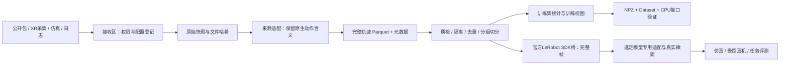

# G1 EDU 数据工程手册：从来源到训练

更新：2026-10-08。读者：有 Transformer、SFT 和 PPO 基础，但刚开始接触机器人数据的实验室成员。

**这套工程的作用，是把来源不同的观测—指令—动作记录，整理为可追溯、可检查、可重复读取的训练样本。** 当前已经能跑通小样本数据流程和 CPU 行为克隆训练接口。G1 EDU 真机尚未接入；行走、导航、负载搬运和预训练 VLA 的能力实验仍待开展。

建议阅读顺序：本文理解结构 → [手工复现](14-g1-edu-manual-reproduction.md) 实际操作 → [字段与训练导出](16-training-export.md) 看张量 → [存储与运行](15-storage-versioning-operations.md) 部署。以前的 [数据集目录](02-dataset-catalog.md) 与 [下载清单](11-download-priorities.md) 仍可作为候选索引。

## 1. 已经明确的方向，以及它怎样改变数据需求

已确认采购 **宇树 G1 EDU**，但“EDU”还不足以确定具体的关节数、手型、控制器和算力。不能直接用公开 G1 数据集的动作向量下发给这台机器人。请用 [采集契约模板](../configs/g1_edu_capture_contract.example.json) 向供应商填写真实配置。

“自由走路”和“搬东西”至少涉及四项不同能力：

| 能力 | 模型/系统通常学习或执行什么 | 需要的数据 | 起步验收例子 |
|---|---|---|---|
| 运动控制 | 跟随前进、侧移、转向速度指令；维持平衡 | 关节状态、IMU、速度指令、接触、动作、仿真 reward/termination | 受控环境中跟随指定速度，统计失稳、跟踪误差 |
| 自主导航 | 判断可行走区域、定位、避障、到达目标 | 相机/深度或地图、位姿、目标、轨迹、障碍、接管事件 | 规定区域内到达目标，记录碰撞、接管、到达率 |
| 上肢操作 | 看懂目标并抓取、放置、调整手臂和手 | RGB、关节/末端状态、语言、示范动作、任务结果 | 固定站位抓取同类物体，统计成功率与掉落 |
| 持物移动 | 抓牢物体后保持平衡并移动，再放下 | 前三类联合记录，外加质量、受力/触觉、载荷姿态、滑移/掉落 | 限定质量、路线和摆放位置的一次完整搬运 |

宇树官方提供 [基于 Isaac Lab 的 RL 环境](https://github.com/unitreerobotics/unitree_rl_lab)，其 README 列出 G1-29dof 速度任务及先 sim2sim、再 sim2real 的过程。这说明**运动控制可以从仿真 RL 路线起步**；本文不据此断言出厂控制器采用哪一种内部算法。自主导航还需要定位、规划和障碍处理，不能仅由“已能站稳行走”推出。[官方 MuJoCo 工具](https://github.com/unitreerobotics/unitree_mujoco) 提供低层消息的仿真验证接口，真机消息可用性仍取决于控制模式。

对当前目标的建议：先分别完成“已有控制器下的行走日志采集”和“固定站位上肢示范”，确认数据与控制接口，再组合持物移动。对应的低层 RL 记录目前属于采集设计，尚未导出为本项目的训练视图。

## 2. 数据来源究竟有哪些形式

“开源、仿真、遥操作、购买”不是互斥分类。开放性描述权限；真机/仿真描述环境；遥操作/自动策略描述谁产生动作。同一批数据可以是“公开、仿真、遥操作”。

| 来源 | 原始交付物通常是什么 | 给模型的主要价值 | 进入本管线的实际状态 |
|---|---|---|---|
| 公开机器人示范 | LeRobot 的 Parquet/MP4/元数据；RLDS/TFRecord；HDF5；MCAP；JSON/图片 | 行为先验、任务多样性、模型微调和工程对照 | 小样本 LeRobot v2/v3 已接入；其他格式需新增 adapter |
| 实验室 G1 XR 遥操作 | 每条任务 `data.json`、`colors/`、`depths/`、`audios/`；实际字段取决于采集器版本 | 本机手型与控制器下的正确动作示范；最直接的任务监督 | 新增 XR JSON + 一路 RGB 的转换；用合成 XR 结构验证，尚无本实验室真机数据 |
| G1 控制/导航运行日志 | DDS/ROS2 消息、MCAP/rosbag 或自定义 JSON/Parquet，外加视频与标定 | 故障分析、速度控制、导航、接管学习、在线改进 | 原始保留和契约已设计；ROS2/MCAP 及行走训练 adapter 未实现 |
| 目标本体仿真 | 场景配置、随机种子、状态、相机、策略动作、reward、done、物理参数 | 在目标 G1 配置上试验、生成示范、覆盖接触与负载变化 | 既有 NVIDIA 双臂 Panda 模拟操作小样本已验证；G1 仿真生成环境未部署 |
| 运行中的机器人 | 策略执行轨迹、成功/失败、接管动作、模型版本、延迟 | 找到模型的薄弱场景，并采集针对性纠正数据 | 可按本地 JSON 契约注册；自动从机器人采集未实现 |
| 商业采购 | 数据包、schema、许可、采集报告、同步和标定、复现工具 | 为缺失任务、设备或场景补充高质量数据 | 先做小包验收；暂不绑定供应商 |
| 人类视频/动捕 | 视频、人体/手部姿态、文本、事件 | 视觉和动作先验，重定向或世界模型学习 | 与机器人动作监督分开存储；不直接当 G1 action 标签 |

只有视频，没有机器人动作，不能直接计算动作行为克隆的监督损失。只有低层行走日志，没有任务语言，也不应随意编造“搬箱子”标签。缺哪些字段就记录哪些缺口，按对应模型路线处理。

### 2.1 当前实际持有的公开小样本

[来源锁](../configs/demo_sources.lock.json) 固定了三个来源的下载 revision、选中 episode、相机、文件字节数和 SHA256：

| 本地 source_id | 实际来源与范围 | 用途 | 不能推出的结论 |
|---|---|---|---|
| `g1_real` | [NVIDIA G1 Teleop](https://huggingface.co/datasets/nvidia/PhysicalAI-Robotics-GR00T-Teleop-G1)，pick-apple 子任务，6 条完整轨迹、一路相机 | G1 上肢数据形状、语言、动作和视频读取验证 | 不能代表我们的 G1 EDU 手型、自由行走或负载搬运 |
| `panda_sim` | [NVIDIA X-Embodiment Sim](https://huggingface.co/datasets/nvidia/PhysicalAI-Robotics-GR00T-X-Embodiment-Sim)，锁定双臂 Panda 穿引子集，6 条 | 仿真操作数据接入和不同动作维度 | 不是目标 G1 的仿真环境或搬运策略 |
| `abc_real` | [ABC 的 LeRobot v3 smoke 子集](https://huggingface.co/datasets/lerobot/abc_130k_v3_smoke)，6 条 | 共享视频、共享 Parquet 的 episode 边界解析 | 未审计 ABC 全量，也未完成所有 v3 shard 变体适配 |

这里的 source_id 以锁文件实际值为准；同名公开数据集的其他版本并不会自动进入这一批。旧实测总量为 18 条轨迹、23,109 个时刻、590 个窗口，约 212 MB 原始文件；这些是三类机器人来源的合计，不能说成 18 条 G1 搬运示范。

本次另外生成的 `g1_edu_synthetic` 是 **2 个虚构通道、8 条教学轨迹**，用于离线复现接入流程。它没有物理仿真，也不是真实 G1 数据。

### 2.2 G1 优先获取什么

机器可读索引：[G1 来源与工具清单](../catalog/g1_edu_sources.json)。

1. **与采购配置匹配的 G1 上肢任务小包**：宇树 G1 Dex1 系列、NVIDIA G1 Teleop，先比较相机、关节与手部定义，再选一个任务。操作任务不能替代行走数据。
2. **全身参考与目标 G1 仿真工具**：宇树 UnifoLM/WBT 类数据可研究全身动作定义；Unitree RL Lab/MuJoCo 是工具代码，安装后才能生成 rollout，工具仓库本身不是现成训练数据集。
3. **实验室自采**：采购配置确认后，采集短而完整的抓取、放置、行走、接管和失败轨迹。现场匹配往往比盲目扩大跨本体数据量更有价值。
4. **其他厂商数据**：智元、Galaxea、RoboMIND 等用于理解任务和方法，须保持独立 embodiment/动作契约。跨设备适配要解决运动学、控制方式、手型、相机和频率，文件转换解决不了这些物理差异。

不在本机新增大规模下载。公司环境先按 [下载计划](11-download-priorities.md) 取元数据及完整的少量 episode，核验训练用途和许可后扩量。

## 3. 遥操作记录具体长什么样

宇树 [XR 采集器](https://github.com/unitreerobotics/xr_teleoperate) 与 [官方学习工具](https://github.com/unitreerobotics/unitree_IL_lerobot) 提供采集和转换路线。实际结构须以固定版本源码及文件为准，本次源码 SHA 见 [上游证据](../evidence/g1-edu-upstream-2026-10-08.json)。

```text
capture/
  task_name/
    episode_0001/
      data.json
      colors/000000_color_0.jpg ...
      depths/...
      audios/...
```

简化示意，数值和关节名均为教学占位：

```json
{
  "info": {"image": {"fps": 30}, "joint_names": {"left_arm": []}},
  "text": {"goal": "把盒子放到台面上"},
  "data": [{
    "idx": 0,
    "colors": {"color_0": "colors/000000_color_0.jpg"},
    "states": {"left_arm": {"qpos": [0.1, 0.2]}},
    "actions": {"left_arm": {"qpos": [0.12, 0.22]}}
  }]
}
```

`states` 表示采集到的机器人状态，`actions` 表示控制侧给出的动作。两者的差异由控制器、采样时刻和执行延迟决定，不能用下一时刻的 state 自动冒充当时 action。`qpos` 字段名也不能独立证明单位、绝对/增量语义或已生效的控制命令。

XR 当前固定版本的原始记录使用 `idx`；该版本不能据此证明有硬件曝光时间、动作生效时间或跨设备同步。我们的转换器若采用 `idx/fps`，会记录 `nominal_idx_over_fps_NOT_measured_hardware_time`。图片与关节处于同一保存行，只证明数据写在一起。

不同采集器可能根本没有 `result`，或其值是字符串。缺失结果保留 `null`；只有显式填写 `result_map` 才映射为 true/false，绝不将全部示范默认为成功。

原始深度保存格式也需核查。某些采集器将深度写入图片文件；必须确认数值编码、缩放和精度，不能将普通 JPEG 当成已标定的米制深度。当前训练视图只选择一路 RGB，其他模态完整保留在原始层。

## 4. 数据整理全过程



图表示逻辑关系；实际批处理会在写 canonical 之前检查轨迹，媒体检查也在发布前进行。官方 SDK 桥直接回放完整原始帧，不从 64 像素的 smoke 视图导出。

| 步骤 | 输入 → 输出 | 关键检查 | 代码位置 |
|---|---|---|---|
| 1 接收 | 下载包/完成写入的采集目录 → incoming | 来源、权利、任务、机器人配置；禁止处理仍在写入的 episode | 操作契约与手册 |
| 2 原始保留 | XR 完整目录 → `prepared/original/` + 转换凭据 | 原始每个文件 SHA256；不删深度、音频或其他未用字段 | `unitree.import_unitree` |
| 3 明确映射 | raw + mapping → 本地 episode JSON + MP4 | 字段路径、关节顺序、单位声明、相机；不自动重定向 | `unitree.flatten` / `encode_images` |
| 4 注册锁定 | 本地批次 → `raw/id/revision/` + source lock | 相对路径、字节数、SHA256；同 revision 不可修改文件或元数据 | `register.register_local` |
| 5 解析 | LeRobot/local JSON → Episode 内存对象 | episode 边界、帧索引、shape、任务、共享视频 offset | `readers` |
| 6 质量与去重 | Episode → accepted/quarantine/duplicate | 时间单调、有限值、关节维度/名称、缺失模态、数值完全重复 | `quality` / `pipeline` |
| 7 切分 | 原始 session/episode group → train/validation | 同 origin_group 始终同 split；默认按 episode 只适合工程验证 | `assign_split` |
| 8 归一化 | 仅 train → 每来源 mean/std | validation 不参与拟合；来源/本体不能直接混用统计 | `fit_stats` |
| 9 训练窗口 | anchor 时刻 → RGB + state + language + H 步 action + mask | 动作不跨 episode，过去帧选择，语言不包含未来事件 | `decode_at` / `action_chunk` |
| 10 发布 | 暂存目录 → 不可变 release | 所有产物哈希；重复运行复用；失败不更新 latest | `pipeline.run` |
| 11 训练读取 | 明确 release → NumPy/Torch batch | 维度、类型、mask、统计绑定、可回溯原始轨迹 | `WindowDataset` / `training` |
| 12 训练框架导出 | accepted 的完整原始帧 → 官方 SDK 数据集 | 固定 SDK；选一个来源和 split；SDK 首尾回读验收 | `lerobot_export`，可选桥 |

“归一化”是数值尺度处理，不是把 Franka、智元和 G1 的动作统一成同一种物理动作。我们的实现保留原生动作维度，按来源隔离；实际跨本体学习还需要模型的 embodiment 配置或明确的重定向。

### 4.1 出错怎样处理

- 时间不单调、NaN、视频丢失：记录在 `quality.json`，对应 episode 不进入训练窗口。
- 原始文件哈希不符、来源元数据损坏：终止整次处理，防止引用不确定版本。
- XR 转换缺图片、字段维度错、idx 缺口或不规则实测时间：转换批次拒绝发布；检查原始原因，明确修复规则后另建派生批次。
- 同一 source 内关节维度或顺序变化：隔离异常轨迹；应按机器人/控制契约拆成不同 source，不能补零掩盖变化。
- 源内找不到 train：可保留 canonical，但不从 validation 估计统计，也不生成该来源训练视图。
- 新资料补标成功/失败、修正语言、调整频率：新 revision、新 release；不改已发布数据。

### 4.2 当前明确未实现的部分

目前是单进程、少量数据的批处理原型。尚未实现：多相机同步训练视图、行走/IMU/接触/力数据的训练 adapter、ROS2/MCAP/RLDS 直接读取、场景级自动划分、近重复检测、分布式作业、S3/DVC/lakeFS 后端、真实时钟标定和动作重定向。LeRobot v3 reader 目前针对已锁定的 smoke 布局，不能宣称兼容所有当前 v3 文件布局。官方 SDK 导出桥是否实际通过，查看 [本次验收](../reports/g1-edu-2026-10-08/acceptance.md)，与基础管线结果分别列出。

## 5. 这些数据为什么能帮助训练

对已有 LLM 知识，可以把行为克隆看成“有物理动作标签的 SFT”：给定观测、语言与机器人状态，拟合专家动作。离散动作可使用交叉熵；连续动作可使用回归、扩散或 flow matching。模型架构决定数据适配和 loss，并不存在一种 Parquet 文件能直接通用所有 VLA。

| 数据变化 | 有望改善的能力 | 原因 | 应如何验证 |
|---|---|---|---|
| 同任务更多高质量本机示范 | 抓取动作的可靠性 | 增加本机观测到正确动作的覆盖 | 固定测试任务、重复次数和控制配置 |
| 不同场景、光照、物体位置 | 视觉鲁棒性与泛化 | 避免只记住单个背景/位置 | 保留未见过的场景、物体或 session |
| 带语言差异的任务 | 条件任务选择 | 提供相近观测下不同指令对应不同动作的对比 | 同场景换指令，看是否执行相应任务 |
| 同步力/接触和失败/接管 | 接触处理、恢复 | 明确接触事件及纠正时机 | 卡住、滑移、接管率与恢复成功率 |
| G1 仿真 RL rollout | 平衡和速度跟踪等低层能力 | 反复交互与 reward 学到状态反馈 | sim2sim/受控真机跟踪与失稳统计 |
| 负载与完整搬运过程 | 持物移动协同 | 显示不同质量、重心和抓持对动作的影响 | 载荷分档、掉落、姿态、完成时间 |

这些是训练假设，需要实验验证。数据量扩大并不保证提升；错误动作、时序错位、失败轨迹被当作专家、切分泄漏都可能让离线 loss 好看而真机变差。世界模型可以用于预测、规划和仿真辅助，但仍需要机器人动作定义、交互数据和闭环评测，不能省掉这条数据工程链。

## 6. 给主管的简短解释

> 我们现在把数据来源、原始格式、统一轨迹、质量检查、版本追溯和训练窗口连成了可复现的工程流程，并用公开小样本和明确标注的合成数据验证。采购 G1 EDU 后，应先确认具体手型、关节与控制接口，采集匹配本机的短任务示范和行走日志，再选择模型开展仿真及受控真机验证。格式转换和 CPU 接口训练已经能够演示，G1 行走或搬运能力还未验证。
