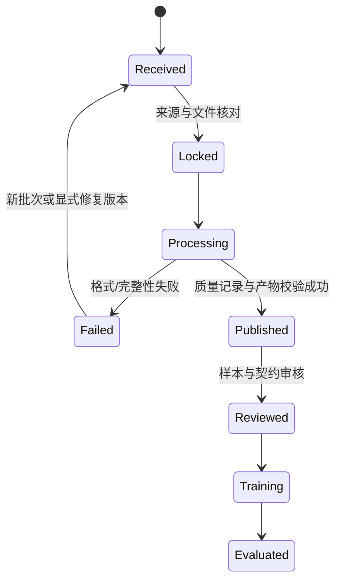

# 存储、版本与持续运行

这是目前实现与后续扩展的明确分界。基础管线是**单写入者的本地批处理**；共享数据盘、对象存储、DVC 和调度系统可以后续接入，但当前没有这些服务的自动部署或分布式锁。

## 1. 四层数据存储

| 层 | 存什么 | 如何使用与管理 |
|---|---|---|
| 接收区 `incoming/` 或 capture | 下载包、已完成的采集目录、交接 manifest、配置与权限 | 可以还未审核；不作为训练入口。采集期间不要扫描尚未完成的文件 |
| 原始层 `raw/source_id/revision/` | 原始/保留快照、映射、来源描述、转换入口文件；逐文件哈希 | 注册后按不可改写批次使用；只读权限可由部署管理员设置，应用校验不能替代 OS 权限 |
| 发布层 `releases/release_id/` | 完整数值轨迹、质量记录、统计、训练窗口、来源锁、规则和产物哈希 | 验收后固定引用；新输入/规则/代码产生新 release；旧版本保留 |
| 实验层 `runs/` / `checkpoints/` | 训练配置、数据 release_id、代码/统计哈希、环境、seed、模型及评估结果 | 模型和评测必须与数据版本绑定，不只保存 `model.pt` |

起步可以把数据根目录放在一块可靠的数据盘：Linux `/srv/vla-data` 或挂载盘 `/mnt/vla-data`，Windows `D:/vla-data`。这些是部署示例，不是本机已经存在的服务。跨平台配置使用相对 POSIX 路径；CLI `--root` 可指定实际根目录。

```text
repository/                         Git：代码、文档、配置模板、锁和小型证据
  src/  scripts/  docs/  tests/
  configs/  catalog/  evidence/

/srv/vla-data/                      数据盘：不放进 Git
  raw/g1_edu_lab/batch-001/
  raw/g1_edu_lab/batch-002/
  releases/8f.../
  releases/ab.../
  latest.json                      便利指针；训练应使用明确 release
  exports/lerobot-<release>-train/
  runs/<experiment-id>/
```

`.gitignore` 排除了 `data/`、`*.parquet`、视频、NPZ、模型权重等。若真实批次的来源锁、语言或配置含企业敏感信息，将它们保存到公司内部版本库或数据盘；**不能因为模板和示例锁位于公开仓库，就把真实内部批次上传到 GitHub**。当前脚本不自动上传数据。

## 2. 当前怎样管理版本

| 对象 | 版本凭据 | 检查位置 |
|---|---|---|
| 公开下载文件 | 上游固定 commit/revision、URL、bytes、SHA256 | `configs/demo_sources.lock.json` |
| 本地采集批次 | source id、revision、配置、完整文件锁 | `register-local` 生成的 lock；raw 中 `.pipeline-registration.json` |
| XR 转换 | mapping 哈希、原始全部文件哈希、时间声明、转换结果 | `mapping.json`、`conversion.json`、source lock；代码包含在后续 release code hash |
| 数据处理发布 | 输入 lock + recipe + `src/vla_pipeline/*.py` 内容哈希 | `manifest.json`；release_id 为这些内容哈希的前 24 位 |
| 训练统计 | 每来源 state/action mean/std 和仅 train episode 列表 | `statistics.json` 与检查点 statistics_sha256 |
| 模型检查点 | data release、数据管线/训练代码哈希、维度、seed、steps、optimizer | 当前 CPU 探针 checkpoint 与 `training_probe.json` |
| 官方 SDK 导出验收 | 固定 SDK commit、完整原生帧、来源/规则/统计 sidecar、导出文件哈希、官方回读与 padding | `verify_lerobot_export.py` 的 SDK 验收 JSON；不等于模型能力测试 |
| 完整实验 | 另存 Git commit、依赖锁哈希、GPU/NPU/驱动、训练配置、评测集 | 实验记录约定；完整模型框架需补齐自己的 run manifest |

release_id 是**内容版本标识**，不是日期或模型效果排名。相同输入、规则和实现重跑会先校验旧产物，再复用。`latest.json` 只是最后成功处理的指针，不代表经过任务能力验收的推荐版本。

当前 code hash 覆盖包内 Python 文件，包括 adapter 和训练工具；修改其中任意文件都会生成新 release。它不包含所有外部脚本和操作系统，所以跨机器复现还需记录 `uv.lock`、Git commit 和平台环境。压缩器/库版本差异可能导致派生媒体的字节哈希不同；原始快照及实际转换凭据是检查依据。

应用的“不可改写”具体保证是：注册时拒绝同 revision 的不同内容/描述；运行时核对原始文件；发布时不覆盖同名 release，检查已有产物。它不意味着文件系统已经开启 WORM，也不能阻止管理员手工修改 manifest。正式留存应增加只读权限、受信任清单/签名及独立备份。

## 3. 新数据如何加入

### 新任务/同配置的新批次

1. 接收完整新采集批次并登记 session；确认采集器已停止写入。
2. 创建新的 revision，例如 `batch-002`；同一原始任务的片段保持相同 origin_group。
3. 在新目录转换和注册；检查原始 SHA、mapping、成功/失败和同步假设。
4. 生成新 lock、运行处理、审核隔离记录和样本预览。
5. 将明确的 release_id 提交给模型训练任务；保留上一版作为对照。

当前一个 source 只引用一个 revision，并不自动拼接所有历史批次。小规模累计训练需生成包含全部所选 episode 的累计 revision；新/旧不同的 origin_group 保持稳定。把两个相同 id 的 source 放入一个锁会被拒绝。按批次使用不同 source id 虽能分别处理，但会各自计算归一化，不能宣称已经实现同一机器人统一统计的增量训练。

### 配置/手型/控制器变化

创建新的契约和 source id，明确改变了什么。不能因为都是 G1 EDU 就混在一个 state/action 空间。更换相机也可能改变视觉输入；更换控制频率、关节顺序、绝对/增量动作或手型必须重新检查。

### 规则变化

剪裁、重采样、语言修订、成功标签、不同 horizon/分辨率等均以新派生版本表达。当前实现的 recipe 可调整 horizon、anchor stride、每 episode 最大 anchors、image size 和切分种子；normalize/action_rate 只支持既定模式，不是可任意填字符串的实际算法插件。

切分种子不要为了改善分数频繁更换。当前稳定分组哈希约为 80/20，数量较小时不会恰好 80/20；新数据的统计会改变，旧样本分组保持稳定但归一化后的字节可变化。

## 4. 备份、恢复和空间规划

最低备份对象：原始层、来源锁与转换凭据、选定 release、模型和运行配置。规则可重建派生窗口，但原始图像、真实控制命令和失败记录通常无法重采，所以原始层优先备份。建议主副本、另一故障域副本和离线/不可变备份；使用前先进行一次恢复演练。

当前工具没有自动备份功能。可用公司允许的文件同步/备份系统，**先复制到新目录，再核对文件锁和 release 的 `verify`，校验成功后才切换路径**。禁止用“同步成功”替代逐文件校验。

小样本恢复检查示例：

```bash
uv run --frozen vla-pipeline verify /restored-data/releases/<release_id>
uv run --frozen vla-pipeline run --lock /restored-data/sources.lock.json --root /restored-data --offline
```

来源锁通常保存在数据根旁或内部版本库，按实际布局调整路径。第二条会重新核对 raw 哈希，缺文件时失败；如代码版本不同，会生成新 release，而不是假装恢复了旧实现。

空间预算需要计算：原始图像/视频 + 保留快照 + 派生 MP4 + canonical + 训练视图 + 多版本与备份。当前 XR 教程会同时保留 capture、prepared/original 和 registered raw，便利但有多份副本；大规模部署应先引入内容寻址或引用登记以减少重复，当前没有自动去重复的物理存储后端。

估算采集量时用实测码率、时长、相机数和记录频率：

`RGB 视频字节 ≈ 总秒数 × 各相机实测 bit/s 之和 ÷ 8`

未压缩 RGB 1920×1080×3×30Hz 约 186.6 MB/s，10 分钟约 112 GB（十进制）；这只是未压缩理论值，真实视频/JPEG体积应先采一分钟实测。数值轨迹通常远小于图像；深度、触觉、备份和多版本另计。不要根据教学 64×64 图片推算真实实验室容量。

## 5. Ubuntu / Windows / 内网环境

基础数据工程要求 Python 3.12，依赖由 uv.lock 锁定；当前 CI 对 Ubuntu 24.04 和 Windows 运行基础测试。**这不表示机器人 SDK、仿真器、GPU 训练也支持相同环境**。宇树采集/学习工具的 Python、NumPy、Pinocchio 等要求不同，应按固定官方版本另建环境。

建议分为三类独立环境：

| 环境 | 用途 | 依赖边界 |
|---|---|---|
| `data-core` | 哈希、转码、检查、训练视图、接口演示 | 本项目基础依赖；Torch 可选 |
| `robot-capture` | XR、SDK、真实机器人采集 | 供应商验证的 Ubuntu/Python/固件组合 |
| `model-train` / `simulation` | 选定模型、LeRobot/GR00T/openpi、仿真/RL | 模型自己的锁、CUDA/NPU、驱动、URDF/物理参数 |

对于公司内网：在相同 OS/架构/Python 的联网准备环境下载 wheels、模型/数据指定 revision 和校验清单，按企业介质流程转入；内网独立建环境并验收。单纯拷贝源码不包含依赖、原始数据、模型权重或机器人环境。昇腾与 CUDA 训练栈的兼容性也应单独验证，格式能读取不代表模型框架已支持某个加速器。

## 6. 如何持续运行

现在以 CLI 手工批处理作为基线即可：每批 manifest → register → run → verify → 人工审核 → 训练。先让单机稳定，不必为了几个 batch 引入集群组件。

新增自动化时，建议最小作业状态如下：



状态中 `Reviewed`/`Training`/`Evaluated` 属于运行管理设计，当前 CLI 只实现锁定和发布，并不自动批准训练或部署。作业表至少保留 job_id、lock_sha、recipe_sha、Git commit、起止时间、状态、错误、release_id、负责人。单机文件锁/数据库租约、多写入者并发和排程需要后续实现；现在同一数据根禁止同时启动多个写任务。

## 7. 资源与日常检查

- 运行前/运行期间执行 `python scripts/resource_status.py`；设置数值库线程为 1；转码器和默认 CPU 探针线程为 1。
- Linux 可另看 `free -h`、`top` 和已安装的厂商 GPU 工具；Windows 看任务管理器和硬件监控；脚本读取不到温度时保持未知。
- 发现内存压力、热告警或显著干扰用户工作时停止本任务，缩小数据、降低线程/批量或分段再跑。当前资源脚本是只读监控，不是自动节流服务。
- 检查数据盘余量、最近备份、raw 哈希、quality 隔离原因、split 与统计拟合 episode、训练/评测的数据版本。
- 删除数据前先核对模型与报告是否仍引用该 release；当前没有引用计数和自动 GC，不应按“不是 latest”就删除。

## 8. 从原型到生产的下一步

优先补真实 G1 capture contract 和时钟测量，然后按确定任务扩展传感器与训练 adapter。数据量上升后再补单写入者锁、作业数据库、对象存储、分片/缓存、原始内容寻址、备份恢复和访问审计。数据湖/调度工具能解决管理问题，但仍需要我们定义动作与同步语义。
